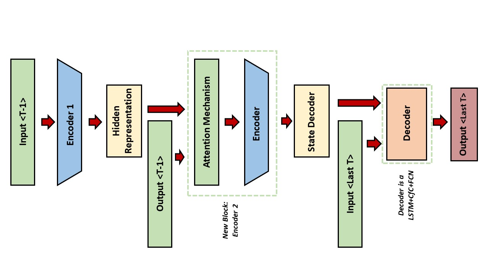

# CfC for Weather Science

In this repository it's presented the research I've done at [MIT](https://www.mit.edu/) in collaboration with [Università la Sapienza di Roma](https://www.uniroma1.it/en/pagina-strutturale/home) and [ENI S.p.a](https://www.eni.com/en-IT/home.html).

In this work is explored the possibility to use a [black box](https://towardsdatascience.com/why-we-will-never-open-deep-learnings-black-box-4c27cd335118) approach to make previsions on Weather Features, such as Temperature, Humidity, Precipitation, etc.\
In this current scenario the coding is entirely done in [Python](https://www.python.org/), using the [Pytorch](https://pytorch.org/) library. 
The results obtained here are an extention of the model capabilities explored in [CfC for Material Science](https://github.com/Marcelaus98/CfC-for-Material-Science),
but here the architecture deployed to make possible such previsions is more complex.

In this work was used a particular kind of [Transformer](https://builtin.com/artificial-intelligence/transformer-neural-network), ispired by the research paper [Short-term load forecasting based on LSTM networks considering attention mechanism](https://www.sciencedirect.com/science/article/abs/pii/S0142061521010346?via%3Dihub), but equipped with a more complex and powerful [LSTM](https://www.bioinf.jku.at/publications/older/2604.pdf)+[CfC](https://www.nature.com/articles/s42256-022-00556-7) block instead of pure [LSTM](https://www.bioinf.jku.at/publications/older/2604.pdf) and with a different Decoder arrangment.

## Graphical Representation of the Network

The Main Structure of the Network is shown below.

Focusing on the Encoder part, it is composed by a connection between a [LSTM](https://pytorch.org/docs/stable/generated/torch.nn.LSTM.html) Layer and a [CfC](https://www.nature.com/articles/s42256-022-00556-7) Layer wired with [NCP](https://publik.tuwien.ac.at/files/publik_292280.pdf) policy. This part differs from [CfC for Material Science](https://github.com/Marcelaus98/CfC-for-Material-Science), it misses the Multi-Head Attention Layer and the Encoder block here is not repeted more than once. Technically it was possible to implement such architecture, but the accuracy was good even with this simpler structure, so it wasn't necessary a more complex one.

Looking closely to each component of the Encoder, the first structure the data encounters is a [LSTM](https://pytorch.org/docs/stable/generated/torch.nn.LSTM.html) Layer, a more complex version of a standard [Recurrent Neural Network](https://www.simplilearn.com/tutorials/deep-learning-tutorial/rnn)\
This type of RNN has two different internal states:

+ **Hidden** (*h*)
+ **Memory** (*c*)

Those states can change value using a gating mechanism shown in the image below. The simultaneus presence of both *hidden* and *cell* state allows both long term and short term memory regarding the input datas. \
This gives this particular architecture, the ability to better *mine* the structure of the data, working particularly well when a perioicity of some kind is present.\
A downside of this architecture is that, having more variables, is harder to train, for this sometimes is preferred the [GRU](https://towardsdatascience.com/understanding-gru-networks-2ef37df6c9be) structure. In this work LSTM convergence was not a problem, so a GRU implementation wasn't needed nor explored.

After the [LSTM](https://pytorch.org/docs/stable/generated/torch.nn.LSTM.html) Layer is present a [CfC](https://www.nature.com/articles/s42256-022-00556-7) block. This particular structure is shown below, but it can be imagined as a RNN with time handling. 

The CfCs used in this work are a particular approximation of the Liquid Time Constant ([LTC](https://arxiv.org/abs/2006.04439)), essentially they allow a better continuous transition between hidden states using time data.\
Normally in a standard RNN such as GRU or LSTM the hidden states are passed from the state *i* to the *i+1* without considering the effective **distance** between the entry points.\
This isn't a problem in most datasets, because entries are equally spaced between each other, but in case of some unevennes in the data, the accuracy of the predictions quickly deteriorates. \
Some attemps have been made using a [RNN with a time depending decay](https://www.nature.com/articles/s41598-018-24271-9), but generally the issue wasn't solved.\
A more complete answer to the problem was given using a [Neural ODE Network](https://arxiv.org/abs/1806.07366). This kind of network could better model the changing between hidden states. The price to pay in this architecture was the increased complexity and a generally longer runtime and this significantly reduced its applications.\
CfC networks on the other hand, are lightweight computational-wise and are more robust to great unevennes in data and are, generally, capable of a better overall convergence and accuracy even in an equally spaced scenario when compared to LSTM and GRU.

The CfC Networks in this study have been wired not using a Fully-Connected Approach, but using the [NCP](https://publik.tuwien.ac.at/files/publik_292280.pdf) policy to ensure sparsness and faster computation.\
A great advantage of this kind of connection is the possibility to cut the synapses between neurons without weighting on the Optimizer. Having a wider structure but with fewer parameters to optimize, allows the network to efficiently learn complex structures in the dataset.\
In the image below is shown the discussed wiring between CfC layers

It is important to mention that in this Network, given a sequence of lenght *T* of input points, only the first *T-1* points are sent to this first section.

After this **First Encoder**, the **Compressed Information** is combined with the sequence of *T-1* previous known observations in a second **different** Encoder. In this layer the **Compressed Information** retrieved from the first Encoder it is used to perform an attention mechanism on the previous *hidden state* and *cell state* of the **Second Encoder**. The **Context** information retrieved is concatenated with the *T-1* long sequence of previous known observations and the retrieved tensor is fed to a series of LSTM and CfC Cells that output the next *hidden* and *cell* state of the **Encoder 2** block.
The structure is shown below.

Lastly after the Encoder Layers, the *hidden* and the *cell* state are passed in a CfC Decoder and are used to initialize it. At this point the last data entry of the *T* long input sequence is used to generate the **output**

## Contributing

For major changes, please open an issue first
to discuss what you would like to change.

## License

[Apache License](http://www.apache.org/licenses/LICENSE-2.0)

